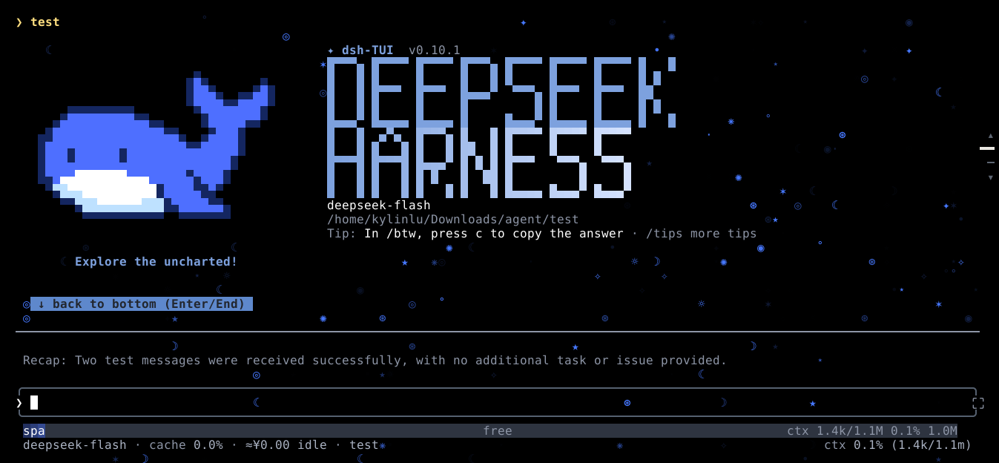

# ✨ dsh-astra

> A compact animated starfield for the dsh-TUI status area.

The plugin selects the safest rendering surface exposed by its host. Current
dsh-TUI releases provide a three-row status view; hosts that later expose the
optional ambient seam can receive a full-terminal starfield without changing
the starfield core.

## Branch convergence

- The `dev` host-integration direction has been folded into `main`.
- `main` is now the intended single development line; the old `dev` branch can
  be removed after this change is committed and verified in dsh-TUI.

<p align="center">
  
  
  
</p>

---

## Preview

<p align="center">
  
</p>

This image is a full-terminal design target, not a screenshot of current
dsh-TUI output. With dsh-TUI `0.10.1`, the plugin safely selects the available
three-row status view. Ambient rendering activates only if a future compatible
host explicitly exposes `registerAmbient`.

## Quick start

```sh
dsh plugin --profile dsh-tui add dsh-astra
```

Then launch dsh-TUI as usual:

```sh
dsh --profile dsh-tui
# or: dst
```

The starfield appears as a three-row status view on supported dark TTY terminals.

---

## Controls

| Command | Effect |
|---------|--------|
| `/astra on` | Enable starfield |
| `/astra off` | Disable starfield |
| `/astra toggle` | Toggle on/off |
| `/astra status` | Show config: density, fps, env |
| `/astra spark\|luna\|terra\|sol\|astra` | Select intensity |
| `/astra color white\|deepseek\|gold` | Select colour in memory |

Command changes affect the running process only and are not persisted. Although
`src/settings.ts` contains a settings prototype, it is not registered by the
current plugin entry point, so no `/settings` section is available yet.

The profile schema accepts `enabled`, `fps` (4–20), `density`
(`sparse|normal|dense`), `intensity` (`off|spark|luna|terra|sol|astra`), and
`color` (`white|deepseek|gold`). The `layout` option accepts `auto` (prefer
ambient, then safely fall back), `full` (request ambient but still fall back),
or `compact` (use only a bounded status surface).

---

## Environment

| Variable | Values | Default |
|----------|--------|---------|
| `DSH_TUI_ASTRA_EFFECT` | `auto`, `on`, `off` | `auto` |

- `auto` — on for dark TTY terminals; off for light themes / non-TTY
- `on` — force enable
- `off` — force disable

The variable is evaluated at startup. When theme information is absent, theme
detection currently assumes a dark theme.

---

## Visual states

| Agent state | Starfield |
|-------------|-----------|
| **idle** | Sparse stars, independent twinkle |
| **thinking** | Fixed inward displacement toward centre |
| **working** | Fixed horizontal displacement |
| **completed** | Brief brightness burst → decay |
| **interrupted / error** | Dim to 25% |

---

## Architecture

```
dsh-TUI
  ↓ ctx.tuiStatus.registerView()
dsh-astra
  ├── starfield.ts    — star generation + twinkle (pure, deterministic)
  ├── states.ts       — session events → AgentState
  ├── renderer.ts     — Ink/React starfield component
  ├── compat.ts       — terminal capability detection + degradation
  ├── commands.ts     — /astra slash commands
  ├── surface.ts      — auto/full/compact surface selection
  └── settings.ts     — unregistered /settings prototype
```

The plugin obtains `tuiStatus` through `ctx.get('tuiStatus', false)`. It uses an
ambient surface when the host explicitly provides one, otherwise it calls
`registerView({ maxRows: 3 })`. It does not import dsh-TUI source internals.

---

## Terminal support

| Terminal | Colour | Detail |
|----------|--------|--------|
| iTerm2, Kitty, WezTerm, Ghostty, Warp | 16M TrueColor | Full sparkle glyphs ✦ ⋆ ✧ |
| xterm-256color, tmux, screen | 256-colour | Greyscale dots, 4fps cap in multiplexers |
| xterm, linux console | 16-colour | Bold / normal / faint |
| No detected colour | Plain | Plain fallback glyphs |
| Non-TTY / detected light theme | — | Auto-disabled |

## Current limitations

- The released dsh-TUI `0.10.1` package does not expose ambient or
  arbitrary-height status surfaces, so released hosts remain limited to three
  rows. The ambient contract is validated on
  [`lql341/dsh-TUI:feat/tui-ambient-surface`](https://github.com/lql341/dsh-TUI/tree/feat/tui-ambient-surface)
  and proposed upstream in [Discussion #905](https://github.com/ccch1mneyyy/dsh-TUI/discussions/905).
- `/settings` is not wired into `apply()`.
- Slash-command changes are not persisted.
- If the plugin starts disabled, no view is registered; `/astra on` cannot add
  that missing view without a restart.
- Thinking and working are state-dependent poses, not accumulating movement.
- Effective fps is calculated at startup; runtime fps changes are not exposed.

See [docs/ROADMAP.md](docs/ROADMAP.md) for the adaptive-rendering plan.

---

## Install from npm

```sh
npm install -g dsh-astra
```

Then add to your dsh-TUI profile:

```sh
dsh plugin --profile dsh-tui add dsh-astra
```

---

## Development

```sh
git clone https://github.com/lql341/dsh-astra.git
cd dsh-astra
pnpm install
pnpm build
pnpm test
```

---

## License

MIT — see [LICENSE](LICENSE).
